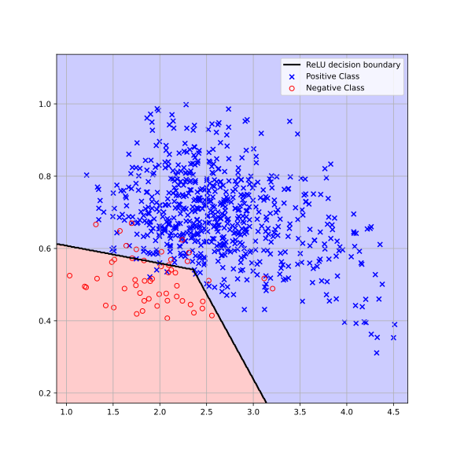
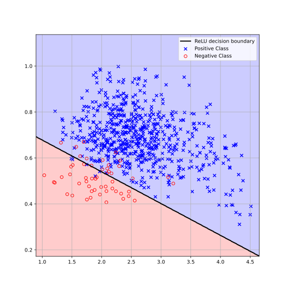

# Deep-ICE: The first globally optimal algorithm for empirical risk minimization of two-layer maxout and ReLU networks (ICLR 26)

Xi He [(email)](xihe@pku.edu.cn), Yi Miao, Max A Little 

If you use DeepICE, please cite our paper:

Xi He, Yi Miao, Max A. Little. "Deep-ICE: The first globally optimal algorithm for empirical risk minimization of two-layer maxout and ReLU networks." The Fourteenth International Conference on Learning Representations (ICLR 26)

**Deep-ICE** is the first *globally optimal* algorithm for empirical risk minimization in two-layer rank-$K$ maxout networks with one neurons—i.e., for minimizing the number of misclassifications in classification tasks. The algorithm has a worst-case time complexity of
$$
O\left(N^{DK+1}\right),
$$
where $N$ is the number of training examples, $D$ is the number of features, and $K$ is the number of hidden neurons.

Our experiments show that Deep-ICE computes **provably exact solutions** for small datasets. To scale to larger datasets, we propose a novel **coreset selection strategy** that iteratively reduces the dataset size, making exact optimization feasible. This hybrid approach yields **20–30% fewer misclassifications** on both training and test data compared to state-of-the-art methods such as neural networks trained via gradient descent and support vector machines—when applied to equivalent models (e.g., two-layer networks with fixed hidden units and linear models).


## Algorithms

We provide two implementations of Deep-ICE: one in CUDA and one in Python using PyTorch. Both implementations have worst-case time complexity$O\left(N^{DK+1}\right)$.

* **Deep-ICE CUDA**: This version is designed to calculating the exact solution efficiently, with minimal memory usage. In our implementation, we developed a **memory-free strategy** that avoids storing nested configurations, resulting in a memory complexity of $O\left(N^{D}\right)$. Due to the memory-free design, this version does not support bounding techniques, which can impact solution optimality.
* **Deep-ICE Pytorch**: This version is the basic Deep-ICE without using the memory-free technique used in CUDA version. Thus has a memory complexity of $O\left(N^{D(K-1)}\right)$ memory usage. Suitable for small datasets where exact memory tracking is feasible.
* **Deep-ICE with coreset selection**:  Wraps the Deep-ICE algorithm in a **randomized coreset selection method**. The input dataset is progressively reduced until it is small enough to be solved exactly. This is the version used in most of our experiments and is particularly effective for **large-scale datasets**.


## Requirements

### CUDA Version

To execute the CUDA version of the Deep-ICE algorithm, the following dependencies are required:

CUDA Toolkit                 12.x
C++ compiler                 Tested with 11.4.0
Make                               >=4.0
Nvidia GPU                     >=sm\_70 

### Python Version

To run the PyTorch-based Deep-ICE implementation:

torch                   2.2.2+cu121

### Coreset Selection

To use Deep-ICE with coreset selection:

torch                   2.2.2+cu121

## Python Usage example

Load the library, read in a dataset:

``` python
import numpy as np
from coreset import Deep_ICE_coreset
from Deep_ICE import Deep_ICE

# Load the CSV file
data = np.loadtxt("datasets/voicepath_data.csv", delimiter=",")

data = np.unique(data, axis=0)

X = data[:,:-1]
t = data[:,-1]
N,D = X .shape
```
We first normalize the dataset so that each feature lies within the range [−1,1]. To ensure the data is in general position, we remove all duplicate entries and add zero-mean Gaussian noise with a standard deviation of $1\times10^{-1}$):

```python
X = np.unique(X, axis=0)

min_val = X.min(axis=0)   # Minimum value of each column
max_val = X.max(axis=0)   # Maximum value of each column

epsilon = 1e-8
X = 2 * (X - min_val) / (max_val - min_val+epsilon) - 1

# Add noise to the dataset
np.random.seed(2024)
noise_std_dev = 1e-8 
noise = np.random.normal(0, noise_std_dev, size=X.shape)
X_noisy = X + noise
```
We then run the Deep-ICE algorithm with coreset selection on the preprocessed dataset:

``` python
K=2 #number of hyperplanes
L = 10 #heap size
M = 20 #block size
max_unchanged = 1 #count the number of unchange of coreset
Bmax = 25 #the maximal block size that deep-ice algorithm can process
threshold = 5 #the threshold for unchange
num_candidates=500 #number of candidate configurations


best_candidates= Deep_ICE_coreset(X, t, K, L, M, max_unchanged, Bmax, threshold, num_candidates=500)
best_candidates = [(vec, val.cpu().item(),block) for vec, val,block in best_candidates]
```

This returns the best network `best_candidates[0]`, and the corresponding best objective `best_candidates[1]`

Alternatively, Deep-ICE can be run directly by initializing the data block with the entire dataset:

``` python
inds = [i for i in range(N)]
inds = inds[:132] 
res = Deep_ICE(inds[:132], X, t, K, 500, P=True)

print(f'The optimal rank-{K} maxout network with one maxout neuron has a 0-1 loss {res[1]}, which is constructed by nested combination {res[0]}')
```
The current Python implementation cannot process the entire `voicepath_data` dataset due to memory constraints, but it is guaranteed to find the exact solution by stage 132.

## CUDA Usage example

### Build and Run

Example of running voicepath\_data.csv in normal mode with K=2 (K is defined in include/types.h):

```shell
$ cd src
$ make
$ ./deep_ICE_GPU
```

### Command-line Flags

Or, use flag -i followed by path to input file:

```shell
$ ./deep_ICE_GPU -i ../dataset/voicepath_data.csv
```

##  Performance on real-world data

We compare the global optimal solution of a rank-2 maxout network with one neuron on a real-world dataset containing N=704 data items in $\mathbb{R}^{2}$. The exact solution returned by the Deep-ICE algorithm (left) has a 0-1 loss of 16, while the 0-1 loss of the same network trained by using gradient descant (right) is 25:

<table>
  <tr>
    <td>
      <figure>
        
        <figcaption style="text-align:center;">(a) Deep-ICE (0-1 loss: 16)</figcaption>
      </figure>
    </td>
    <td>
      <figure>
        
        <figcaption style="text-align:center;">(b) Gradient descent (0-1 loss: 25)</figcaption>
      </figure>
    </td>
  </tr>
</table>